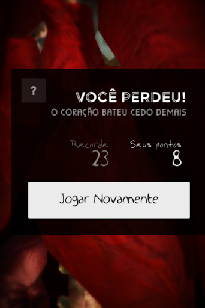

# Coração do Jack

A simple Unity3D game where you need to keep Jack alive by beating his heart. Touch the screen to make the heart beat in a correct rythm to mantain Jack alive during different daily activities. Try not to cause cardiac arrest or explode his heart.

 

## Usage
- Install Unity3D (tested for v2019.3)
- Open the project folder
- Hit Play and have fun!
